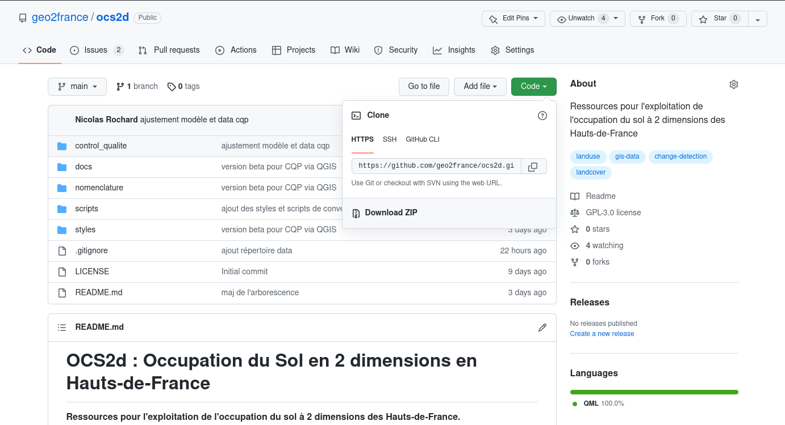
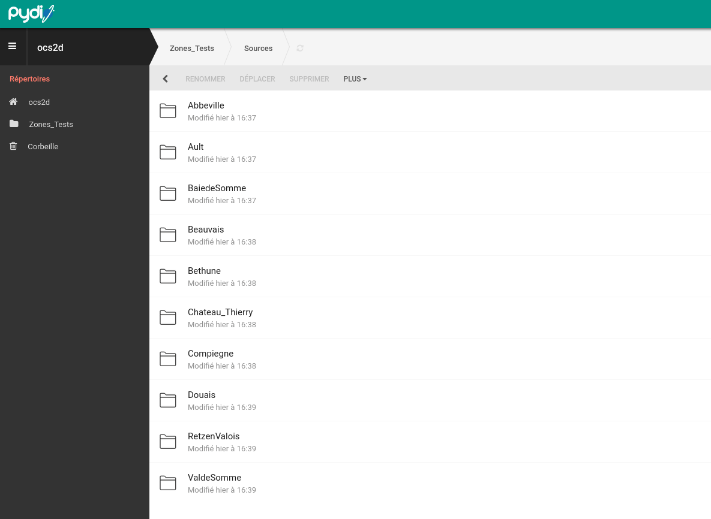
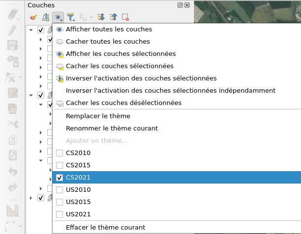
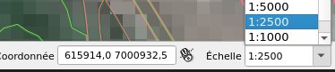
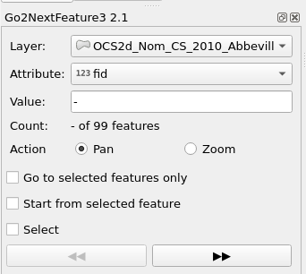

# Contrôle Qualité Partenarial (CQP) de l'OCS2d avec QGIS

Ce document l'utilisation des ressources préconfigurées et optimiser la vérification des différents polygones CS (couvert) et US (usage) sur le territoire des Hauts-de-France.

## Prérequis

- QGIS version LTR [3.22] ou supérieure
- Une connexion Internet (les fonds de plan sont des flux OGC)

## Ressources en ligne

- Télécharger l'intégralité du dépôt via le bouton **Code** > Download ZIP

- Télécharger la zone test à vérifier depuis le répertoire **Sources** via Pydio sur Geo2France accessible depuis : <https://www.geo2france.fr/files/ws--28/Zones_Tests/Sources>

> :information_source: **Vous devez être membre du CoTech OCS2d et connecté sur le portail Geo2France** :information_source:

## Indexer des couches téléchargeables

Référencer les fichiers téléchargés dans le tableau en ligne ci-dessous et n'oubliez pas de mettre à jour le champ **Etat** (liste déroulante)
[Index_Couches_Zones_Tests_CQP](https://docs.google.com/spreadsheets/d/141QZYF7PUW_Cr1RG6Ragm9nKG9eFurMOu5JM8RGYMDk/edit?usp=sharing)

## Utilisation de QGIS

### Installation du plugin Go2NextFeature3

Avant de lancer le projet, téléchargez le plugin QGIS Go2NextFeature3. Ce plugin facilite le balayage d'entités.
Dans QGIS : Menu Extensions > Installer/Gérer les extensions > Go2NextFeature3

### Fonctionnement du projet

Décompresser l'archive `ocs2d-main.zip` et ouvrir le projet QGIS situé dans le dossier **control_qualite** : `model_cqp_ocs2d.qgz`

Ce projet contient les données en fond de plan dont vous avez besoin pour le contrôle :

- Couches fusionnées US et CS pour les millésimes 2021 / 2015 (NPDC) / 2010 (PIC)
- L'ensemble des prises de vues aériennes y compris les images historiques pour analyser les US 6.x
- Le Scan 25

Il dispose de thèmes préconfigurés synchronisant les couches et fonds de plan en fonction des types (CS ou US) et des millésimes.

### Ajout des couches à contrôler et formulaire

Glisser/Déposer un des GeoPackages à contrôler dans le projet QGIS.
La mise en forme est automatique et le formulaire est intégré.
Selon l'échelle de visualisation, l'affichage basculera entre polygones et symboles ponctuels.

### Contrôle des données

1. Définir l'échelle au 1/2500

2. Cliquer sur l'icône Go2NextFeature3

3. Sélectionner, depuis le panneau du plugin, la couche du GPKG à vérifier

4. Cliquer sur le nom du GPKG chargé et activer le mode édition

5. Cliquer sur le bouton du panneau Go2NextFeature :fast_forward: pour parcourir les entités

6. Utilisez l'icône _identifier des entités_ pour afficher les informations du formulaire

La partie de droite (non éditable) renseigne des informations actuelles de l'objet. Éditer la partie gauche selon les valeurs possibles.
Si un _code_remplacement_ est sélectionné ou si la case _erreur géométrique_ est cochée, le statut _etat_cqp_ bascule automatiquement en erreur.

Une fois le formulaire validé (le contour du polygone changera de couleur), se rendre à l'objet suivant avec le bouton :fast_forward: et ouvrir le formulaire - étape 5 et 6 - enregistrer régulièrement votre travail 

> :warning: Si le formulaire QGIS ne s'affiche pas, assurez vous d'avoir correctement paramétré QGIS :warning:

### CQP terminé

Le contrôle est terminé lorsque l'ensemble des polygones des différentes couches a été vérifiées.
Vous ne devez plus avoir de symbole :warning: visible sur la carte (ou de polygone avec un contour blanc)

Une fois la phase de contrôle terminée : renvoyer les GPKG sur Pydio/Geo2France dans le dossier **CQ_Finalise**
<https://www.geo2france.fr/files/ws--28/Zones_Tests/CQ_Finalise>

Mettre à jour le champ **Etat** du fichier [Index_Couches_Zones_Tests_CQP](https://docs.google.com/spreadsheets/d/141QZYF7PUW_Cr1RG6Ragm9nKG9eFurMOu5JM8RGYMDk/edit?usp=sharing)

### FAQ

**Q.** La photo aérienne de 1998 semble être décalée par rapport aux données ?

**R.** L'image 1998 sur le Nord-Pas-De-Calais présente un problème de projection, des investigations sont en cours. Cependant, il n'y a pas d'incidence pour le contrôle.

