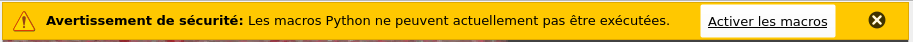
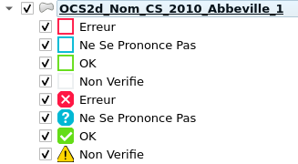

# Contrôle Qualité Partenarial (CQP) de l'OCS2d avec QGIS

Ce document explique l'utilisation des ressources préconfigurées afin d'optimiser la vérification des différents polygones CS (couvert) et US (usage) sur le territoire des Hauts-de-France.

En complément, trois documents essentiels sont à consulter :

- [Dictionnaire de données de l'OCS2d](https://github.com/geo2france/ocs2d/blob/main/documentation/dictionnaire_ocs2d_hdf.pdf)
- [Guide méthodologique du contrôle qualité externe](https://github.com/geo2france/ocs2d/blob/main/documentation/guide_methodo_cqe_ocs2d_hdf.pdf)
- [Questions fréquemment posées lors du contrôle qualité](https://github.com/geo2france/ocs2d/wiki/FAQ-Contr%C3%B4le-Qualit%C3%A9-Partenarial)

## Prérequis

- QGIS version LTR [3.40] ou supérieure
- Une connexion Internet (les fonds de plan sont des flux OGC, en COG, ou en FlatGeobuf)

## Ressources en ligne

- Télécharger l'archive contenant le **Kit_CQP_QGIS** depuis le répertoire du département à contrôler : <https://www.geo2france.fr/portal/s/5/documents?folderId=07216b86ac12000c4b375b2d293397ca>

- Télécharger la zone à vérifier depuis le répertoire **A_Verifier** via l'espace collaboratif sur Geo2France accessible depuis : <https://www.geo2france.fr/portal/s/5/documents?folderId=072201ddac12000c7fe3e428546c1d5f>

> :information_source: **Vous devez avoir un compte Geo2France et être membre de l'espace Occupation du Sol 2d (adhésion libre sans modération)** :information_source:

## Indexer des couches téléchargeables

Référencer les fichiers téléchargés dans le tableau en ligne ci-dessous et n'oubliez pas de mettre à jour le champ **Etat** (liste déroulante)

[Index_Couches_CQP](https://www.geo2france.fr/portal/dw/oeditor?docId=0719e7b3ac12000c54c4d19031ed39d8&mode=edit)

## Utilisation de QGIS

### Fonctionnement du projet

Décompresser l'archive `Kit_CQP_QGIS.zip` et ouvrir le projet QGIS.

Ce projet contient les données en fond de plan dont vous avez besoin pour le contrôle :

- Couches fusionnées (dissolve) US et CS 2024
- L'ensemble des prises de vues aériennes y compris les images antérieures 2021 pour analyser les US 6.x
- Le Scan 25
- Le Registre Parcellaire Agricole de l'IGN
- Les TUP des fichiers fonciers du CEREMA

Il dispose de thèmes préconfigurés synchronisant les couches et fonds de plan en fonction des types (CS ou US) et des millésimes.

### Activer les Macros

A l'ouverture du projet, un avertissement de sécurité s'affichera. Autoriser l'activation des macros.
Cette modification faites suite à un retour en CoTech pour n'avoir que le contour de l'objet lors de l'identification. (par défaut QGIS affiche un fond rouge semi-transparent).

### Ajout des couches à contrôler et formulaire

Glisser/Déposer un des GeoPackages à contrôler dans le projet QGIS.
La mise en forme est automatique et le formulaire est intégré.
Selon l'échelle de visualisation, l'affichage basculera entre polygones et symboles ponctuels.

### Contrôle des données

1. Définir l'échelle au 1/2500

2. Ouvrir la table attributaire du GPKG chargé

3. Basculer en vue formulaire et sélectionner l'option _Panoramique automatique sur l'entité courante_

4. Activer le mode édition

5. Cliquer sur la première ligne pour commencer, la carte se centrera automatiquement sur l'objet à vérifier.

6. Le formulaire s'actualise automatiquement et affiche les informations de l'objet sélectionné.

La partie supérieure (_non éditable_) renseigne des informations actuelles de l'objet.
Seule la partie _Contrôle Qualité_ est éditable.
Si un _code_remplacement_ est sélectionné ou si la case _erreur géométrique_ est cochée, le statut _etat_cqp_ bascule automatiquement en erreur.

Une fois le formulaire validé (le contour du polygone changera de couleur), se rendre à l'objet suivant avec le bouton :fast_forward: et éditer le formulaire au fil de l'eau. Enregistrer régulièrement votre travail 

---

#### Demo

----

### CQP terminé

Le contrôle est terminé lorsque l'ensemble des polygones des deux couches (GPKG) US et CS ont été vérifiés. Vous ne devez plus avoir de symbole :warning: visible sur la carte (ou de polygone avec un contour blanc).

Une fois la phase de contrôle terminée :

1. Renvoyer les GPKG sur l'espace collaboratif Geo2France dans le dossier **Controle_Termine** : <https://www.geo2france.fr/portal/s/5/documents?folderId=072201ddac12000c7fe3e428546c1d5f>

> :information_source: Vous devez être membre du CoTech OCS2d et connecté sur le portail Geo2France :information_source:

> :warning: **S'assurer que la couche au format GPKG n'est plus ouverte dans QGIS avant upload sur Pydio (en cas de doute, fermer QGIS). Lorsqu'ils sont ouverts, les GPKG créés 2 fichiers de verrouillage (`*.gpgk-shm` et `*.gpkg-wal`) qui pourraient empêcher le CQE de vérifier correctement les différentes couches**

2. Mettre à jour le champ **Etat** du fichier [Index_Couches_CQP](https://www.geo2france.fr/portal/dw/oeditor?docId=0719e7b3ac12000c54c4d19031ed39d8&mode=edit)

---

